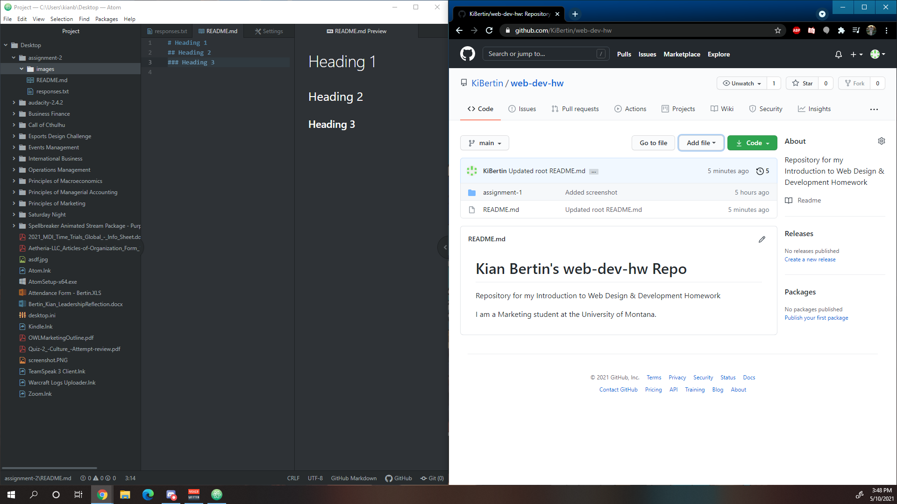

# Assignment-2
## Kian Bertin

Primarily, I am taking this class because it is a requirement within the Marketing program. However, I also hope to utilize this information when working together with my wife to design websites and plan marketing campaigns for clients.

1. I have learned the difference between the internet and the World Wide Web.
2. I have begun to learn how GitHub functions and how useful it can be.
3. I hope to learn how to utilize text editing and website design well enough that it becomes second-nature.

[Facebook Homepage](https://www.facebook.com/)

[My Responses File](./responses.txt)

