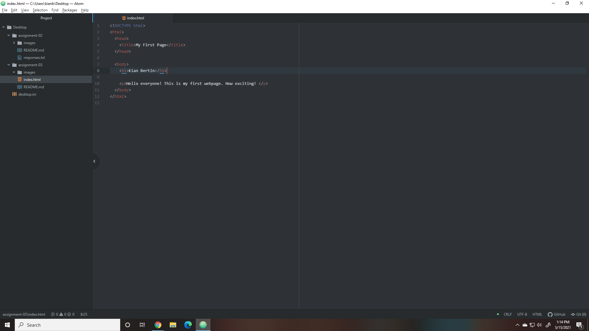

1. A browser works by taking information from documents on a website (through languages such as HTML and CSS), translating it into what is required, and then rendering that information into text, images, and other media. The browsers I use to surf the web are Google Chrome, Microsoft Edge, and Mozilla Firefox.

2. A markup language is a form of text that helps the browser understand the format of a page - most languages mainly focus on text, but there are some that dictate the graphical layout of a website as well. One commonly used markup language in development is HTML, the language we are currently utilizing for this assignment. It is the most widely-used markup language, and has a fairly standardized system.

