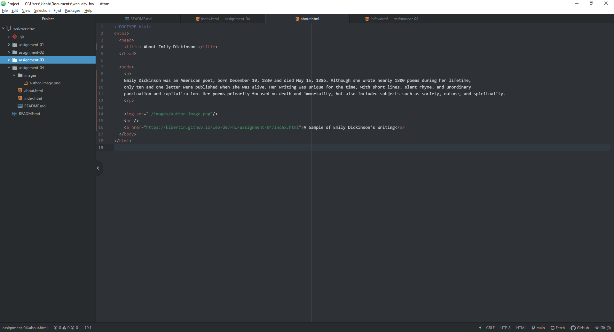

1. I explored the battle.net website of Blizzard Entertainment from ten years ago. In many ways, I can still see the bones of the modern website's design and aesthetic, but there have been multiple small changes. For example, the website ten years ago only showed the games that were available or in development. Now, there are substantial smaller purchases that are shown and available on the home page. I feel like it's a lot more cluttered now, but it definitely fulfills its purpose of attracting people to purchases.

2. With the multiple walkthroughs you provided for the GIT Module, it definitely has proven to be a fairly straightforward process to adapt to it. I was struggling before with how to re-name assignment-01 (as I had originally named it "assignment-1"), but the GIT Module made it super easy. I'm sure that I have a lot more to explore with the program, but I'm loving it so far.

3. 
