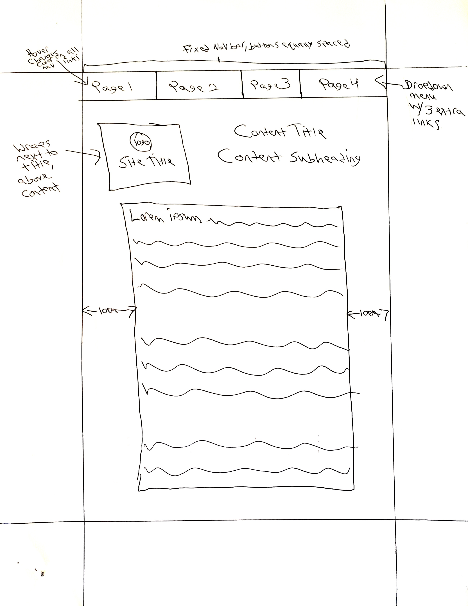

1. A border is the outer edge of an element. Padding is the space between the border of and element and that element's content. Finally, a margin is the space around an element's border.

2. 

3. As always, the hardest part of this project for me was getting started. Once I finally worked my way through figuring out a rough sketch of the website, I was able to fly from there. The trickiest part for me was creating the dropdown menu for Page 4 in the nav menu. I finally had to eventually look up what was wrong with my CSS code, but it finally was able to work out. After that, it was several hours of tweaking the padding, margins, and float of the elements until I was satisfied. Overall, quite a fun project!
